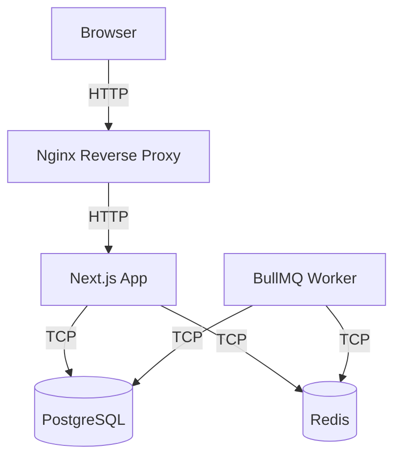

# KOMITKABE Gathering XXVI

Celebrating Our Journey, Shaping What Comes Next.

This is the event management web application for KOMITKABE Gathering XXVI.

## Technology Stack

- **Framework**: Next.js 16 (App Router)
- **Language**: TypeScript
- **UI**: Tailwind CSS, shadcn/ui, Motion, Lucide
- **Database**: PostgreSQL (Drizzle ORM)
- **Queue**: BullMQ / Redis
- **Testing**: Vitest, Playwright
- **Infrastructure**: Docker, Nginx

## Local Development Requirements

- Node.js 20+
- pnpm
- Docker and Docker Compose

## Environment Setup

1. Copy the example environment file:
   ```bash
   cp .env.example .env
   ```
2. Update the `.env` variables if necessary (the defaults work for local Docker setup).

## Installation

```bash
pnpm install
```

## Running Locally

1. Start the infrastructure (PostgreSQL, Redis):
   ```bash
   docker compose up -d postgres redis
   ```
2. Run database migrations:
   ```bash
   pnpm run db:migrate
   ```
3. Start the Next.js development server:
   ```bash
   pnpm run dev
   ```
4. Start the worker process:
   ```bash
   pnpm run worker
   ```

## Docker Startup

To run the entire application using Docker Compose (App, Worker, Postgres, Redis, Nginx):

```bash
docker compose up --build
```
Access the application at `http://localhost`.

## Testing & Quality

- **Lint**: `pnpm run lint`
- **Typecheck**: `pnpm run typecheck`
- **Unit Tests**: `pnpm run test`
- **E2E Tests**: `pnpm run test:e2e`

## Architecture


